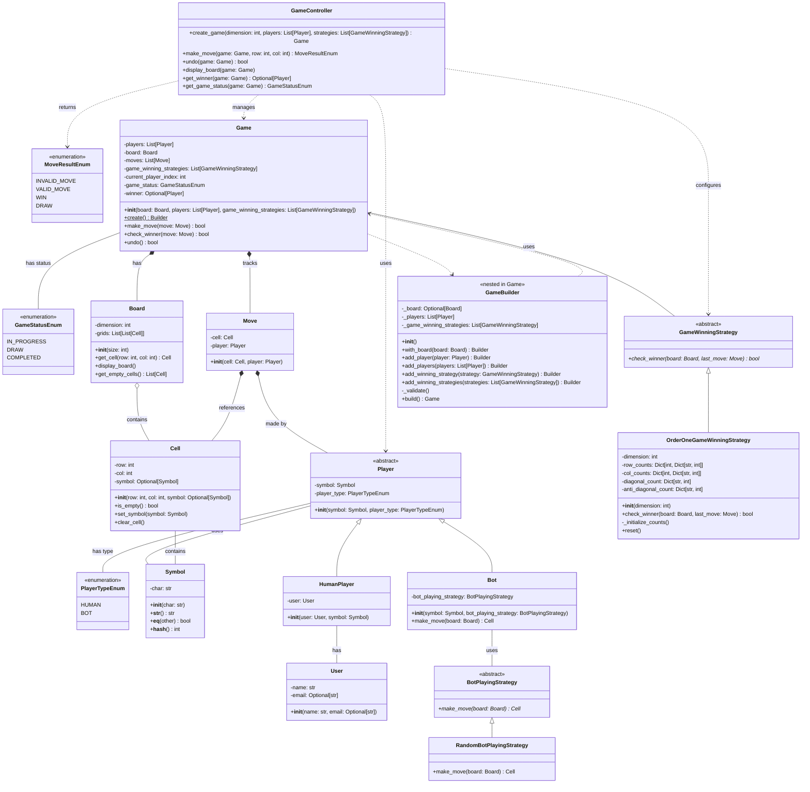

# Tic-Tac-Toe Class Diagram

## Complete System Design

## Design Patterns

### 1. Builder Pattern
- **Class**: `Game.Builder`
- **Purpose**: Construct complex Game objects with validation
- **Benefits**: Readable construction, centralized validation, flexible configuration

### 2. Strategy Pattern
- **Interfaces**: `BotPlayingStrategy`, `GameWinningStrategy`
- **Purpose**: Encapsulate algorithms (bot moves, win detection)
- **Benefits**: Easy to add new strategies, interchangeable at runtime

### 3. Factory Pattern (Concept)
- **Usage**: Controller creates Game objects
- **Purpose**: Centralize object creation logic

### 4. Template Method (Abstract Classes)
- **Class**: `Player`
- **Purpose**: Define common structure for all player types

## Key Relationships

### Inheritance (IS-A)
- `HumanPlayer` IS-A `Player`
- `Bot` IS-A `Player`
- `RandomBotPlayingStrategy` IS-A `BotPlayingStrategy`
- `OrderOneGameWinningStrategy` IS-A `GameWinningStrategy`

### Composition (HAS-A)
- `Game` HAS-A `Board` (strong ownership)
- `Board` HAS `Cells` (strong ownership)
- `Game` HAS `Moves` (strong ownership)

### Association (USES-A)
- `Player` USES `Symbol`
- `Bot` USES `BotPlayingStrategy`
- `Game` USES `GameWinningStrategy`
- `HumanPlayer` USES `User`

### Dependency
- `GameController` depends on `Game`, `Player`, etc.
- `Move` depends on `Cell` and `Player`

## SOLID Principles Applied

### Single Responsibility
- Each class has one clear purpose
- `Cell`: Manages cell state
- `Board`: Manages grid
- `Game`: Manages game state
- `GameController`: Orchestrates operations

### Open/Closed
- Easy to add new `BotPlayingStrategy` implementations
- Easy to add new `GameWinningStrategy` implementations
- No need to modify existing code

### Liskov Substitution
- `HumanPlayer` and `Bot` are interchangeable as `Player`
- All strategies are interchangeable within their interface

### Interface Segregation
- Separate interfaces for bot playing and win detection
- No fat interfaces forcing unnecessary implementations

### Dependency Inversion
- Depend on abstractions (`BotPlayingStrategy`, `GameWinningStrategy`)
- High-level modules don't depend on low-level details

## Validation Rules (in Builder)

1. Board must exist
2. Minimum 2 players required
3. Number of players = board dimension - 1
4. Maximum 1 bot allowed
5. No duplicate symbols
6. At least one winning strategy required

## Time Complexity

- **Make Move**: O(1)
- **Check Winner**: O(1) with OrderOneGameWinningStrategy
- **Undo**: O(1)
- **Display Board**: O(n²)